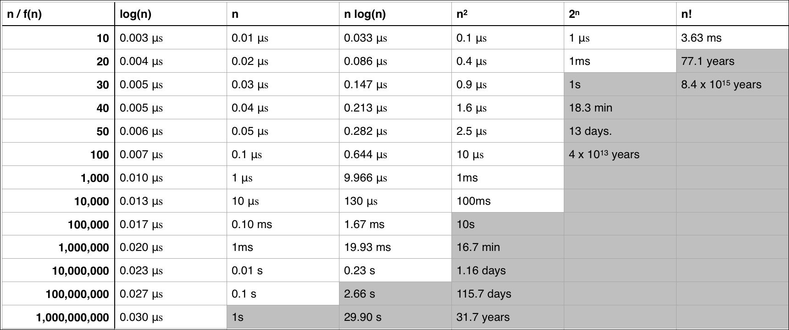

# Big O Notation
**Big O notation** is a representation which is used to represent the upper bound of execution time of an algorithm.
We usually measure the running time of an algorithm by taking the running time of hotspots in the code i.e nested loops and other time expensive operations.We consider only the time taken by the hotspots because they take a large fraction of the execution time of the program and optimising such parts can increase the efficiency of code.

### Order of Complexities : O(n!) >> O(2^n) >> O(n^3) >> O(n^2logn) >> O(n^2) >> O(nlogn) >> O(nlog(logn)) >> O(n) >> O(logn) >> O(1)

### Average Running time of Complexities

# Problem statement
Generate the prime numbers from 2 to a number n

## Input
An integer n which is strictly greater than 2.

## Output
The prime numbers from 2 to the number n 

## Algorithms
1. **Brute force algorithm** 
    - Step 1: Take a number from 2 to n
    - Step 2: Check if the number is prime by dividing it with an integer from 2 to \sqrt{n}
    - Step 3: If the number is divisible then the number is not prime 
    - Step 4: If the number is not divisible by any other number then the number is prime
    - Step 5: Repeat this for all the integers from 2 to n
    ### Complexity : O(n*sqrt{n})
2. **Sieve Of Eratosthenes**
   - Step 1: Initialise a boolean array of size n with the value true
   - Step 2: Take a number i from the sequence 2 to n and check if array[i] is true
   - Step 3: If array[i] is true then set all positions with index that areutiples of i as false
   - Step 4: Repeat this process for all numbers from 2 to n
    ### Complexity : O(n*log(log(n)))
    
3. **Dividing by Prime Factors**
    - Step 1: Create an array to store prime numbers and add the value 2 to the array
    - Step 2: Then for a number i in the sequence 3 to n check if i is divisible by by any primes in the array
    - Step 3: If i is not divisible by any number then i is prime and add the value i to the array
    - Step 4: Repeat this for all the numbers in the sequence 3 to n  
    ### Complexity : O(n*sqrt{n})
